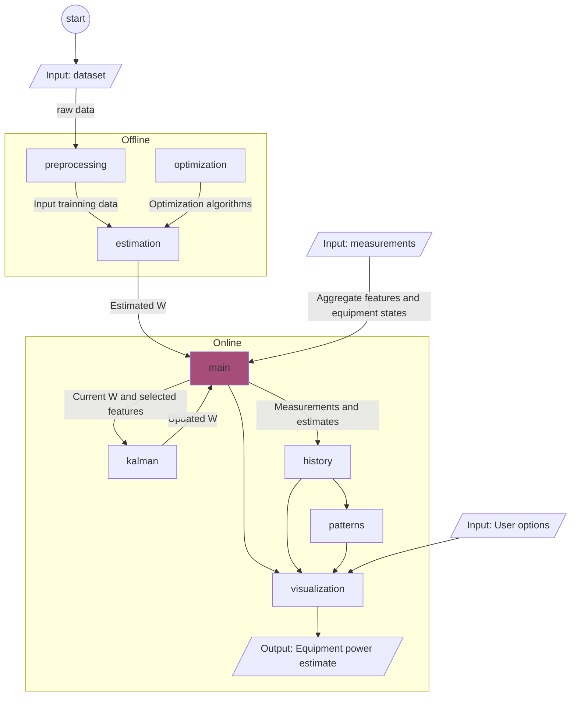
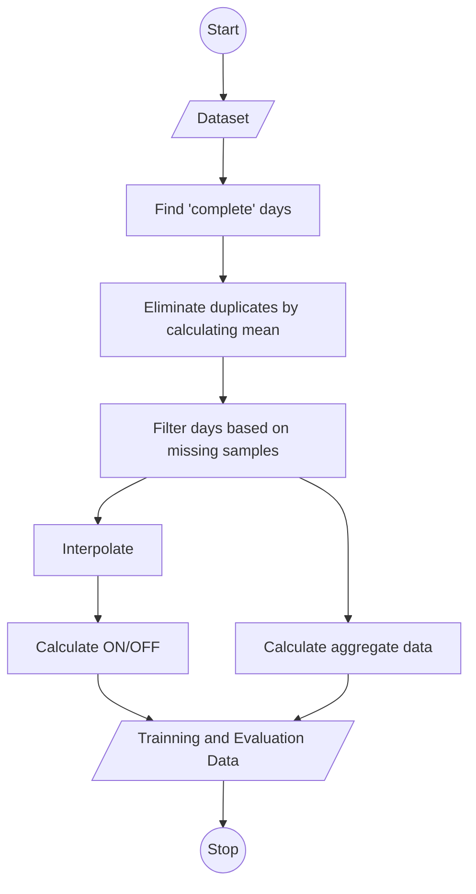

Low-Frequency Unsupervised Non-Intrusive Load Monitoring for Industrial Loads
============================

### Description:

Repo of the code and documentation related to my master's degree dissertation in Electrical and Computer Engineering at the University of Coimbra.

My dissertation titled "Low-Frequency Unsupervised Non-Intrusive Load Monitoring for Industrial Loads" focuses on developing innovative techniques for monitoring industrial loads.

Main contribution: development of a novel method for NILM, called Multi-Modal Functional Matrix Factorization with Ensemble of Numerical and Metaheuristic Optimization and Online Kalman Filtering.

Code developed in MATLAB, Python and C++.

### Structure:
```
.
├── build                   # Compiled files
├── data
│   ├── raw                 # Imdeld dataset
│   ├── interim             # Intermediate data
│   └── processed           # Final dataset for modeling
├── docs                    # Documentation files
├── reports					
│   └── figures             # Generated figures to be used in reporting 
├── src                     # Source files
│   ├── preprocessing       # Analysis, cleaning and transforming of data into suitable format for algorithm
│   ├── estimation          # Estimate values of W
│   ├── kalman		    # Kalman filter to estimate state
│   ├── main
│   ├── optimization        # Optimization algorithms (estimating the coefficients of the functions in the W matrix)
│   └── visualization	    # Code to display the results and performance metrics
├── test                    # Automated tests
├── tools                   # Tools and utilities
├── LICENSE
└── README.md
```

### Architecture:
Multi-modal Functional Matrix Factorization with Ensemble of Numerical and Metaheuristic Optimization and Online Kalman Filtering algorithm flowchart:

Pre-processing algorithm flowchart:

    

### How to install and set up:
```
• Clone the repo.
• Download the imdeld dataset from IEEEDataPort into the data/raw folder.
```

### How to use the repo:
> ToDo


### Link to relevant resources:
> Imdeld dataset: https://ieee-dataport.org/open-access/industrial-machines-dataset-electrical-load-disaggregation

### License
Copyright © 2023 [Daniel Torres](https://github.com/danctorres).<br />
This project is [MIT](https://github.com/danctorres/nilm_disseration/blob/main/LICENSE) licensed.
