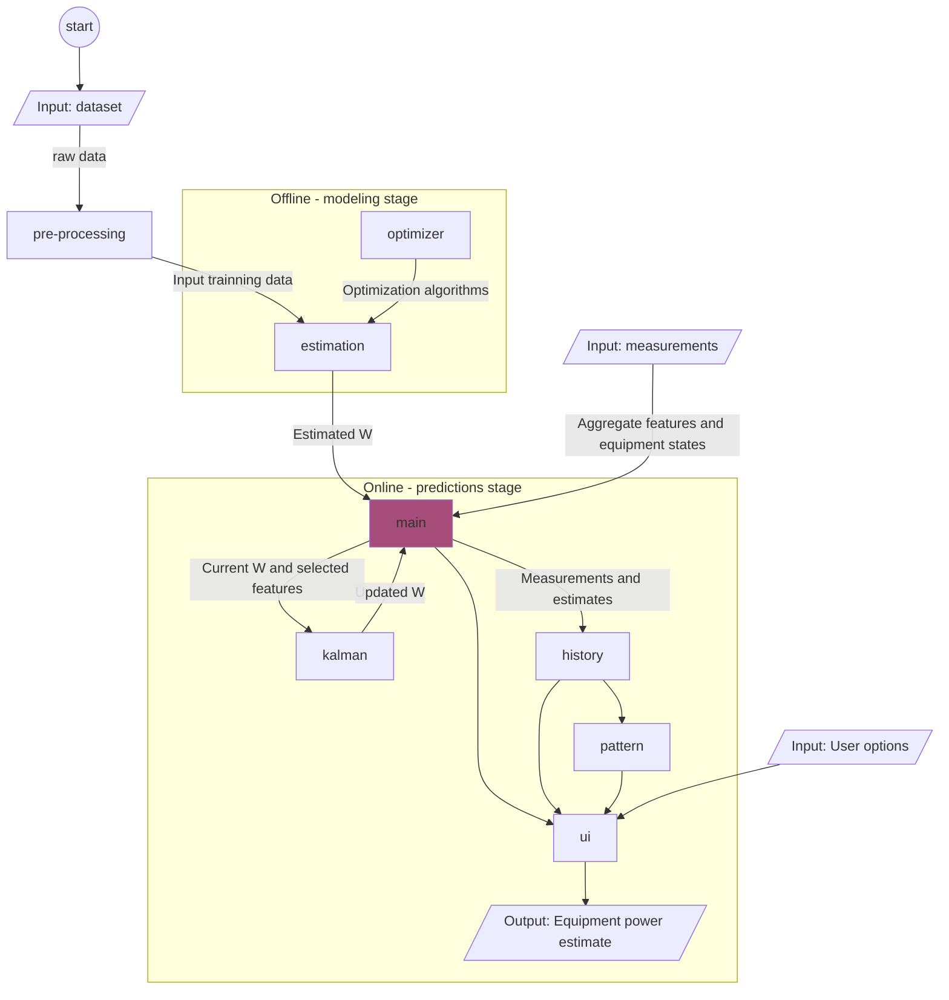

Table of Contents
------

* [Description](#description)
* [Directory Structure](#directory-structure)
* [Software Flowchart](#software-flowchart)
* [How to Set Up](#how-to-set-up)
* [How to Use](#how-to-use)
* [Relevant Resources](#relevant-resources)
* [Licensing](#licensing)
---


Description
------
[Multivariate Functional Matrix Factorization with Ensemble of Numerical and Metaheuristic Optimization and Online Kalman Filtering](https://github.com/danctorres/nilm_disseration) is an innovative algorithm for NILM, developed for my master's degree dissertation in Electrical and Computer Engineering at the [University of Coimbra](https://www.uc.pt/).

My dissertation titled "Low-Frequency Unsupervised Non-Intrusive Load Monitoring for Industrial Loads" focuses on developing a novel NILM algorithm to assist the industrial sector in the reduction of its energy demand. The algorithm performs source separation and could be used by any factory with a [SCADA system](https://en.wikipedia.org/wiki/SCADA), since it does not require data about the individual equipment consumption.


The proposed algorithm, uses the aggregate data and the ON/OFF equipment information from the SCADA system as training data to model each equipment by a polynomial function, the training is offline. The functions are estimated with numerical and metaheuristic optimization algorithms. In the online part of the algorithm, the functions are constantly updated as new measurements arrived by Kalman filtering.
The algorithm was developed and validated using the IMDELD dataset, which required preprocessing.


Directory Structure
------
    .
    ├── build                   # Compiled files
    ├── data
    │   ├── raw                 # Imdeld dataset
    │   ├── interim             # Intermediate data
    │   └── processed           # Final dataset for modeling
    ├── docs                    # Documentation files
    ├── reports					
    │   └── figures             # Generated figures to be used in reporting 
    ├── src                     # Source files
    │   ├── preprocessing       # Analysis, cleaning and transforming of data into suitable format for algorithm
    │   ├── estimation          # Estimate values of W
    │   ├── kalman              # Kalman filter to estimate state
    │   ├── main
    │   ├── optimizer           # Optimization algorithms (estimating the coefficients of the functions in the W matrix)
    │   └── ui                  # Code to display the results and performance metrics
    ├── test                    # Automated tests
    ├── tools                   # Tools and utilities
    ├── LICENSE
    └── README.md


Software Flowchart
------

  

How to Set Up
------
1. Clone nilm repo into your home directory:
``` bash
cd ~
git clone https://github.com/danctorres/nilm_industry.git
```
2. Download the training and validation data
``` bash
git lfs pull
```
3. Run cmake and executable
``` bash
cd /nilm_industry/src/estimation
mkdir build
cd build
cmake ..
make
./estimation
```
[Optional] Download the imdeld dataset from IEEEDataPort into the data/raw folder to run pre-processing MATLAB scripts.
``` bash
cd ~/nilm_industry/data/raw/
download https://ieee-dataport.org/open-access/industrial-machines-dataset-electrical-load-disaggregation
```


How to Use
------
> ToDo


Relevant resources
------
Imdeld dataset: https://ieee-dataport.org/open-access/industrial-machines-dataset-electrical-load-disaggregation

Licensing
------
Copyright © 2023 [Daniel Torres](https://github.com/danctorres).<br />
This project is [MIT](https://github.com/danctorres/nilm_disseration/blob/main/LICENSE) licensed.
